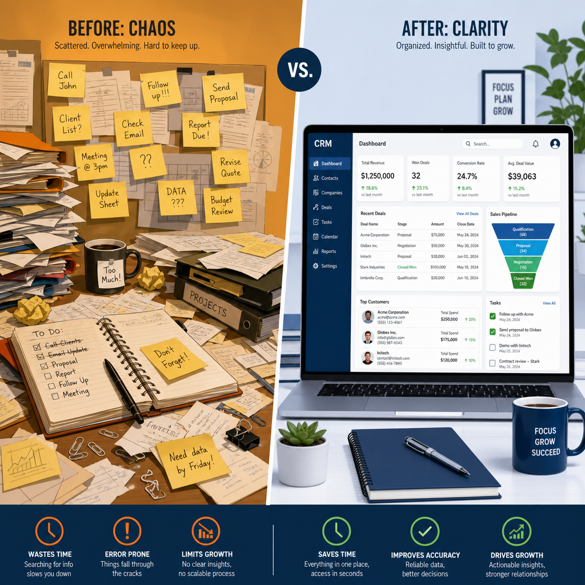
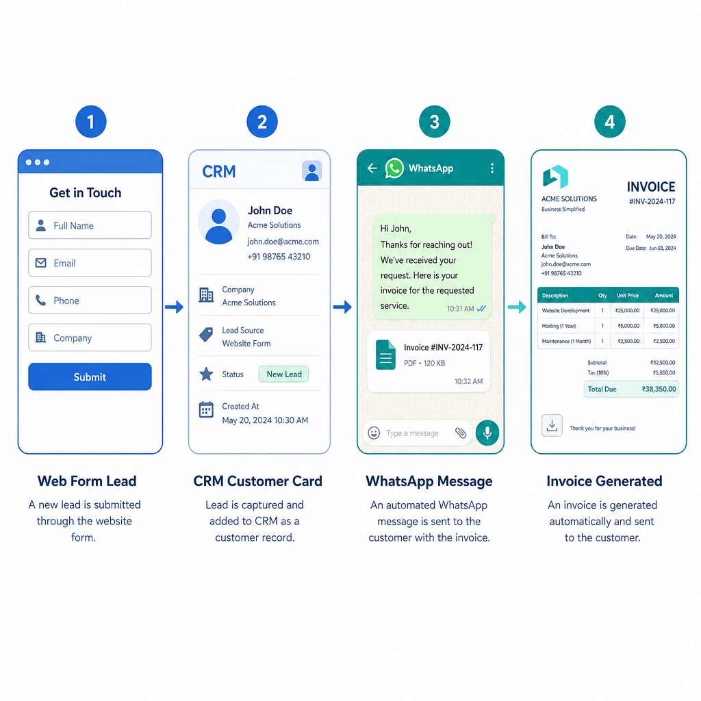

# מה זה CRM — למי שעדיין מנהל לקוחות בפתקיות צהובות

בואו נתחיל מהסוף, כי ככה חוסכים זמן לשניים.

CRM היא מערכת לניהול קשרי לקוחות. המקום שבו גרים הלידים, הלקוחות, הפגישות, המכירות, המנויים והתשלומים של העסק שלך — כולם יחד, במקום אחד, בלי שתצטרך לזכור איפה שמרת את הקובץ.

עכשיו האמת הקשה שאף אחד לא אוהב לשמוע:
עסק שעובד בלי CRM לא יכול לגדול לאורך זמן. אפשר להסתדר בלי זה בהתחלה — אנשים מסתדרים עם הרבה דברים בהתחלה. בשלב מסוים, הבלגן מצטבר, ליד אחד נעלם, עסקה נשכחת, ואיש המכירות שלך מסביר ללקוח שלישית מה השם שלו. זאת תקרת הזכוכית. היא לא עשויה מזכוכית — היא עשויה מאקסל.

---

## מה בעצם קורה מאחורי הקלעים

מבחינה טכנית, CRM הוא אוסף של טבלאות שמקושרות אחת לשנייה. לא מרגש, אבל זה המצב.

יש טבלת לקוחות עם שמות, טלפונים ומיילים.
לצידה, טבלת מכירות עם כל העסקאות שנסגרו.
החיבור ביניהן הוא הדבר שמשנה הכל — כי כשנכנסים לכרטיס של לקוח, רואים הכל: כל מכירה שבוצעה, כל משימה פתוחה, כל היסטוריית שיחות ופגישות. אין ניחושים. אין "רגע, איפה רשמתי את זה". אין פספוסים שמסתתרים בין הפתקים.

---

## מה CRM עושה ביום-יום

אחרי שהבנו שמדובר בטבלאות, בואו נדבר על מה שרלוונטי:

**ריכוז נתונים** — כל פרטי הלקוח בכרטיס אחד. טלפון, מייל, תפקיד, היסטוריה. לא בגוגל דרייב, לא ביומן, לא בראש של עובד שעזב לפני שלושה חודשים.

**תיעוד תקשורת** — המערכת שומרת היסטוריה של מה נאמר, מתי ועם מי. כך כשמתקשר לקוח אחרי שלושה שבועות, לא צריך להתחיל מ"ומה שלומך?" כי שכחת הכל.

**ניהול משימות ופולואפים** — המערכת מתזמרת את הפולואפים. בלי CRM, הפולואפ קורה כשנזכרים בו במקרה, בדרך כלל מאוחר מדי.

**אחסון מסמכים** — הצעות מחיר, חוזים וחשבוניות חיים בתוך הכרטיס של הלקוח. לא בתיקייה ששמה "חוזה סופי סופי v3 עדכני".

**דאשבורדים ודוחות** — כמה כסף נכנס, אחוזי המרה, כמה עסקאות נסגרו החודש. מספרים, לא תחושות בטן.

---

## למה זה שווה את זה — בלי הבטחות מוגזמות

**לידים לא נעלמים.** כל פנייה נכנסת למערכת ומתועדת. הכסף שנשאר על הרצפה בגלל ליד שנשכח — מפתיע כמה זה נפוץ.

**חוסכים זמן.** פחות חיפוש אחרי מספרי טלפון ישנים, פחות ניחוש מה נאמר בשיחה הקודמת. הזמן הנחסך הולך לעבודה שמייצרת הכנסה.

**השירות נראה אנושי.** דוגמה קלאסית: יש פיצריות שמבקשות ממך כתובת ותוספות כל פעם מחדש, גם אם אתה מזמין אותו דבר כבר שנה. זה לא כיף. כשלקוח מתקשר ואתה יודע מי הוא ומה הוא קנה — הוא מרגיש שמכירים אותו. אמון עולה. מכירות עולות. לא מדע.

**מחליטים על בסיס מספרים.** איזה מוצר נמכר, איזה קמפיין עובד, איפה כדאי להשקיע. פחות "נראה לי שאנחנו טובים בזה", יותר "הנה הדאטה".

**כולם עובדים אותו דבר.** כשיש מערכת, יש תהליך. כשיש תהליך, לא משנה מי עונה לטלפון — הוא יודע מה לעשות. זה נקרא סקייל. ומגיע.

---

## למי זה מתאים

תשובה קצרה: לכל מי שיש לקוחות.

תשובה יותר מדויקת:

**עסקים קטנים ופרילנסרים** — "אנחנו עדיין קטנים" הוא ההסבר שאנשים נותנים עד שהם מנסים לגדול ומגלים שהם לא יכולים כי הכל בראש של אחד. לבנות סדר עכשיו, כשזה עדיין קל, זה הסוג של החלטה שמשלמים עליה מאוחר כשלא לוקחים אותה.

**צוותי מכירות** — אין איך לנהל מכירות רציניות בלי CRM. כל עיכוב בחזרה לליד מקטין את הסיכוי לסגור. המערכת דואגת שזה לא יקרה.

**מוקדי שירות לקוחות** — שירות לקוחות בלי גישה להיסטוריית הפניות הוא פיצריה שמבקשת ממך כתובת כל פעם. זה לא מקצועי ולא נסבל.

**חברות B2B** — אם יש מישהו שמעריך מקצועיות ומסודרות, זה עסקים שקונים מעסקים. זה המקום האחרון שבו כדאי להיראות כמי שמנהל לידים ב-Notion בגרסת חינמי.

---

## CRM מול אוטומציה שיווקית — שתיהן קיימות, שתיהן שונות

הרבה אנשים חושבים ש-CRM זה אוטומציה. זה לא אותו דבר.

CRM מנהל קשרי לקוחות. יש בו אוטומציות פנימיות — יצירת משימות, תזכורות, שינוי סטטוסים — אבל הן מוגבלות.

כשרוצים לבנות תהליכים שמחברים שיווק, מכירות ותפעול, צריך מערכת חיצונית. Make, למשל, מאפשרת לבנות אוטומציות מתקדמות שחורגות ממה שה-CRM עצמו יכול לעשות. זה לא פאנצ'ר של ה-CRM — זה פשוט חלוקת עבודה נכונה.

CRM מסודר + מערכת אוטומציה חיצונית = תהליך שרץ לבד. בלי שמישהו יצטרך לזכור לעשות משהו.

---

## איך בוחרים CRM

לא בוחרים לפי מספר הפיצ'רים. לא בוחרים לפי מי מדגים הכי טוב. בוחרים לפי מה הצוות שלך אשכרה ישתמש בו ביום-יום.

שאלות שכדאי לשאול:

- האם זה קל לשימוש? אם זה מסובך, העובדים לא ישתמשו בזה ותקבל CRM שאיש לא ממלא.
- האם יש תמיכה בעברית?
- האם הוא מתחבר למערכות שכבר עובדים איתן?

ולפני שחותמים — לנסות. כמעט כל מערכת מציעה תקופת ניסיון. להשתמש בה עם תהליכים אמיתיים, לא עם שמות בדויים ולידים מדומים.

המערכת הנכונה היא לא הכי יקרה. היא זו שהצוות פותח בבוקר ואפילו לא חושב על זה.

---

## אוטומציות שאפשר לבנות עם CRM

הרשימה אינסופית, אבל הנה הסוגים שחוזרים על עצמם:

- **קליטת לידים** — ליד השאיר פרטים באתר, נפתח כרטיס אוטומטי ונשלחת הודעת וואטסאפ. בלי שמישהו ישב ויעתיק.
- **תזכורות** — לקוח שלא עדכן סטטוס שבועיים? נוצרת משימה: לחזור אליו. לא לשכוח ולגלות חצי שנה מאוחר יותר שהוא קנה אצל המתחרה.
- **ברכות אישיות** — יום הולדת? SMS אוטומטי עם ברכה והטבה. כן, זה עובד. כן, זה מרגיש יותר אישי ממה שזה צריך להרגיש.
- **הפקת מסמכים** — נסגרה עסקה, מופקת חשבונית ונשלחת במייל. לא מחכים שמישהו יזכור לפתוח את הקובץ.

---

## שאלות שאנשים שואלים

**האם CRM מתאים גם לעסק בלי אנשי מכירות?**
כן. CRM לא הומצא רק בשביל מכירות — הוא מנהל לקוחות, תהליכים, שירות ומסמכים. אם יש לך לקוחות, יש לך שימוש.

**כמה עולה?**
מ-0 ₪ ועד מאות שקלים בחודש. תלוי במספר משתמשים, פיצ'רים וכמות הדאטה. יש מערכות חינמיות שמספיקות לעסקים קטנים. יש מערכות יקרות שלא שוות את המחיר. הפער ביניהן הוא לא תמיד ברור מהניסוי של שבועיים.

**האם אפשר לחבר CRM למערכות אחרות?**
כן — וזה אחד הדברים הכי שימושיים. אתר, דפי נחיתה, מערכות חשבוניות, וואטסאפ, Google Drive, ניהול תשלומים, צ'אטבוטים. כל CRM עם גישת API אפשר לחבר למערכות אוטומציה כמו Make ולבנות תהליכים כמעט בלי הגבלה.

**האם זה בטוח? מה עם מידע רגיש?**
רוב המערכות הגדולות עומדות בתקני GDPR ועובדות עם הצפנת מידע. הדבר שחשוב: לבחור מערכת מוכרת ולהגדיר הרשאות נכון בצוות. הסיכון הכי גדול הוא לא פריצה — הוא לתת גישה לכולם כי "קשה עם הגדרות".

**האם CRM יכול להחליף עובדים?**
לא. CRM משחרר לעובדים זמן לעבודות שדורשות בן אדם. פחות מילוי טפסים ידני = יותר שיחות מכירה, שירות טוב יותר, ופחות טעויות שנגרמות מעייפות ושכחה.

**כמה זמן לוקח להטמיע?**
עסק קטן — כמה שעות עד יום. עסק גדול עם צוותים ותהליכים מורכבים — ימים עד שבועות. הטמעה היא לא ההורדה, היא גרימה לאנשים להשתמש בזה באמת.

**האם צריך ידע טכני?**
לא. ממשקי ה-CRM של היום בנויים לאנשים שלא רוצים לקרוא תיעוד. אם פעם עבדת עם אקסל — אפילו ברמה בסיסית — הרמה הטכנולוגית מספיקה. ההגדרה הראשונית לפעמים כן דורשת עזרה מקצועית, בגלל שזה שלב שכדאי לעשות נכון מהתחלה.

**האם CRM מתאים גם לעסק קטן של אדם אחד?**
דווקא כן. כשהכל עליך — CRM הוא הזיכרון החיצוני שלך. הפולואפים, הלקוחות, המסמכים. בלי זה, אתה מתפקד בקיבולת של כמה לקוחות עד שמשהו נופל בין הכיסאות.

---

*בשורה התחתונה: CRM הוא לא פתרון קסם, הוא תשתית. מי שמנהל עסק בלעדיו בוחר לעבוד קשה יותר ממה שצריך — ובשלב מסוים, קשה יותר ממה שאפשר.*
